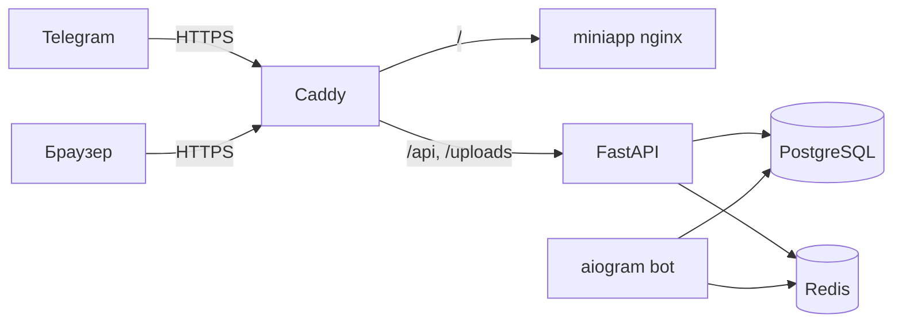

# Деплой в прод (VPS + Docker + HTTPS)

Бот и Mini App 24/7 без ngrok: один домен с HTTPS, Caddy, Docker Compose.

## Что нужно заранее

| Ресурс | Зачем | Если нет |
|--------|--------|----------|
| **VPS** | Linux-сервер 24/7 (1–2 GB RAM, 1 vCPU) | Hetzner CX22, Timeweb, DigitalOcean, Selectel — от ~€4/мес |
| **Домен** | Telegram требует **HTTPS** для Mini App | Купить у регистратора (~$10/год) или поддомен, если домен уже есть |
| **Бот** | Токен от [@BotFather](https://t.me/BotFather) | `/newbot` → скопировать токен |

Без домена Telegram Mini App в проде **не заработает** (IP + самоподписанный сертификат не подходит).

---

## Архитектура



Один URL, например `https://club.example.com`:

- `/` — статика Mini App (сборка Vite)
- `/api/*` — FastAPI
- `/uploads/*` — загруженные картинки

`VITE_API_URL` в проде **пустой** — запросы идут на тот же origin, Caddy проксирует `/api`.

---

## Шаг 1. VPS

### Создать сервер

- ОС: **Ubuntu 24.04** (или 22.04)
- Регион: ближе к пользователям клуба
- SSH-ключ при создании (удобнее пароля)

### DNS

В панели регистратора домена:

| Тип | Имя | Значение |
|-----|-----|----------|
| A | `club` (или `@`) | IP вашего VPS |

Подождите 5–30 минут, проверка:

```bash
dig +short club.example.com
```

Должен вернуться IP сервера.

### Подключиться и установить Docker

```bash
ssh root@ВАШ_IP

apt update && apt upgrade -y
apt install -y git curl

curl -fsSL https://get.docker.com | sh
```

Проверка: `docker compose version`

### Файрвол (рекомендуется)

```bash
ufw allow OpenSSH
ufw allow 80/tcp
ufw allow 443/tcp
ufw enable
```

Порты **5432** и **6379** наружу не открываем — только внутри Docker-сети.

---

## Шаг 2. Код и `.env` на сервере

```bash
cd /opt
git clone https://github.com/ВАШ_АККАУНТ/bg-club-bot.git
cd bg-club-bot

cp .env.prod.example .env
nano .env   # или vim
```

### Обязательно заполнить

```env
DOMAIN=club.example.com
ACME_EMAIL=admin@example.com

POSTGRES_PASSWORD=длинный_пароль_без_спецсимволов

TELEGRAM_BOT_TOKEN=...
TELEGRAM_BOT_USERNAME=your_club_bot

MINIAPP_URL=https://club.example.com
CORS_ORIGINS=https://club.example.com

SECRET_KEY=...   # openssl rand -hex 32
ADMIN_TELEGRAM_IDS=ваш_telegram_id

DEV_AUTH_ENABLED=false
```

Сгенерировать `SECRET_KEY`:

```bash
openssl rand -hex 32
```

---

## Шаг 3. Запуск

```bash
cd /opt/bg-club-bot
docker compose -f docker-compose.prod.yml up -d --build
```

Первый запуск: сборка образов, миграции Alembic, выпуск сертификата Let's Encrypt (1–2 минуты).

### Проверки

```bash
docker compose -f docker-compose.prod.yml ps
curl -s https://club.example.com/api/v1/health
curl -sI https://club.example.com/
```

В Telegram: открыть бота → кнопка меню **«Открыть клуб»** (берёт URL из `MINIAPP_URL`).

### Логи

```bash
docker compose -f docker-compose.prod.yml logs -f caddy api bot
```

---

## Шаг 4. Telegram

1. [@BotFather](https://t.me/BotFather) — бот уже создан, токен в `.env`
2. При старте бот сам выставляет **Menu Button** на `MINIAPP_URL` (см. `bot/bgclub_bot/main.py`)
3. После смены домена перезапустите бота:

```bash
docker compose -f docker-compose.prod.yml restart bot
```

4. Узнать свой ID: [@userinfobot](https://t.me/userinfobot) → `ADMIN_TELEGRAM_IDS`

---

## Обновление после изменений в коде

```bash
cd /opt/bg-club-bot
git pull
docker compose -f docker-compose.prod.yml up -d --build
```

Миграции применятся автоматически (сервис `migrate`).

---

## Отличия от локального `docker-compose.yml`

| Локально | Прод (`docker-compose.prod.yml`) |
|----------|----------------------------------|
| `npm run dev` + Vite proxy | Статическая сборка + nginx |
| `--reload` на API | Без reload |
| Volume с исходниками | Код внутри образа |
| `seed_dev.py` | Нет сида — пустая БД или ручное наполнение |
| Порты 5432/6379/8000/5173 наружу | Только 80/443 (Caddy) |
| ngrok для HTTPS | Caddy + Let's Encrypt |

Локальный compose **не трогаем** — он для разработки.

---

## Mini App: что важно в проде

1. **`VITE_API_URL`** — пустой (по умолчанию в `miniapp/Dockerfile`). Запросы: `/api/v1/...` на том же домене.
2. **Сборка** — `miniapp/Dockerfile` (multi-stage: `npm run build` → nginx).
3. **CORS** — в `.env`: `CORS_ORIGINS=https://ваш-домен` (без слэша в конце).
4. **`DEV_AUTH_ENABLED=false`** — иначе любой сможет зайти как dev-пользователь.

Пересборка только miniapp:

```bash
docker compose -f docker-compose.prod.yml up -d --build miniapp caddy
```

---

## Бэкапы

### PostgreSQL

```bash
docker compose -f docker-compose.prod.yml exec -T postgres \
  pg_dump -U bgclub bgclub > backup_$(date +%F).sql
```

Восстановление:

```bash
cat backup.sql | docker compose -f docker-compose.prod.yml exec -T postgres \
  psql -U bgclub bgclub
```

### Загрузки (картинки)

Том `uploads_data`. Периодически копировать volume или каталог `/app/data/uploads` из контейнера `api`.

---

## Частые проблемы

### Caddy не получает сертификат

- DNS A-запись указывает на VPS?
- Порты 80/443 открыты (`ufw status`)?
- `DOMAIN` в `.env` совпадает с реальным доменом (без `https://`)?

Логи: `docker compose -f docker-compose.prod.yml logs caddy`

### Mini App открывается, API — ошибка

- `curl https://домен/api/v1/health` — должен быть JSON
- Проверить `CORS_ORIGINS`
- Логи API: `docker compose -f docker-compose.prod.yml logs api`

### Кнопка меню в боте не появляется

- `MINIAPP_URL` — полный HTTPS URL
- Перезапуск: `docker compose -f docker-compose.prod.yml restart bot`

### `club_settings does not exist`

Миграции не прошли:

```bash
docker compose -f docker-compose.prod.yml run --rm migrate
```

### Пустая лента / нет клуба

В проде **нет** `seed_dev.py`. Заполните клуб через админку Mini App (ваш Telegram ID в `ADMIN_TELEGRAM_IDS`) или один раз локально экспортируйте данные.

---

## Минимальные требования VPS

| Параметр | Минимум |
|----------|---------|
| RAM | 1 GB (2 GB комфортнее) |
| Диск | 20 GB |
| CPU | 1 vCPU |

Стек: postgres + redis + api + bot + miniapp + caddy ≈ 600–900 MB RAM в покое.

---

## Чеклист перед go-live

- [ ] Домен → A-запись на VPS
- [ ] `.env` заполнен, `DEV_AUTH_ENABLED=false`
- [ ] `MINIAPP_URL` и `CORS_ORIGINS` = `https://ваш-домен`
- [ ] `docker compose -f docker-compose.prod.yml up -d --build` без ошибок
- [ ] `https://домен/api/v1/health` — OK
- [ ] Mini App в Telegram открывается
- [ ] `/start` в боте, кнопка «Открыть клуб»
- [ ] Админ видит админ-панель
